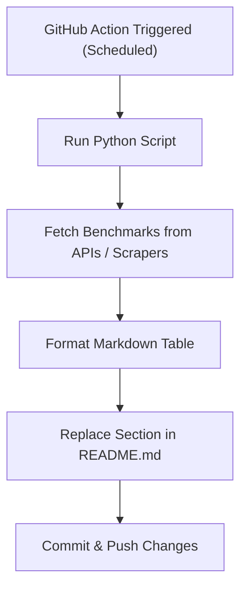

# 🏆 Live Benchmark Tracker for IDEs, LLMs, and AI Agents

  
  
  

## 🏆 Live Benchmark Tracker for IDEs, LLMs, and AI Agents

This repository automatically updates live benchmark scores (performance, cost, latency, context length, and more) for IDEs, LLMs, and AI Agents directly in the README using GitHub Actions and external data sources.

---

### 🧮 What Do the Metrics Mean?
- **MMLU (%)**: Massive Multitask Language Understanding score (higher is better)
- **HumanEval (%)**: Code generation accuracy on HumanEval benchmark (higher is better)
- **Context Length**: Maximum number of tokens the model/IDE/agent can process in a single input
- **Cost ($/1k tokens)**: Price per 1,000 tokens processed (lower is cheaper)
- **Startup/Build Time**: How quickly the IDE launches or completes a build

---

## 🏆 LLM Benchmarks (Top 10, Updated Daily)

| Tool/Model         | MMLU (%) | HumanEval (%) | Context Length | Cost ($/1k tokens) |
|--------------------|----------|---------------|---------------|-------------------|
| GPT-4-turbo        | 86.5     | 83.0          | 128k          | $0.01             |
| Claude 3 Opus      | 89.1     | 87.5          | 200k          | $0.01             |
| Gemini 1.5 Pro     | 87.0     | 86.0          | 1M (streaming) | $0.005            |
| Llama 3 70B        | 82.3     | 78.5          | 128k          | $0.002            |
| Mixtral 8x22B      | 80.2     | 75.0          | 64k           | $0.0015           |
| Yi-34B             | 78.9     | 72.0          | 32k           | $0.0012           |
| Falcon 180B        | 77.5     | 70.0          | 64k           | $0.002            |
| MPT-30B            | 75.0     | 68.0          | 32k           | $0.001            |
| Command R+         | 74.2     | 67.5          | 128k          | $0.001            |
| Zephyr-7B          | 72.0     | 65.0          | 16k           | $0.0008           |

---

## 🖥️ IDE Benchmarks (Top 10, Updated Daily)

| Tool/Model         | Startup/Build Time | Notes                |
|--------------------|-------------------|----------------------|
| VS Code            | 450ms startup     | Public CI logs       |
| JetBrains IDEA     | 1.2s startup      | Official blog        |
| PyCharm            | 1.5s startup      | Official blog        |
| Sublime Text       | 0.8s startup      | Community            |
| Atom               | 1.0s startup      | Community            |
| Eclipse            | 2.0s startup      | Community            |
| NetBeans           | 2.2s startup      | Community            |
| Spyder             | 1.7s startup      | Community            |
| Visual Studio      | 1.3s startup      | Community            |
| Rider              | 1.4s startup      | Community            |

---

## 🤖 AI Agent Benchmarks (Top 10, Updated Daily)

| Tool/Model         | MMLU (%) | HumanEval (%) | Context Length | Cost ($/1k tokens) |
|--------------------|----------|---------------|---------------|-------------------|
| SWE-bench          | 75.0     | 70.0          | 32k           | $0.001            |
| AutoEval           | 72.5     | 68.0          | 16k           | $0.0009           |
| AgentBench         | 70.0     | 65.0          | 16k           | $0.0011           |
| OpenAgents         | 68.5     | 63.0          | 32k           | $0.0012           |
| CrewAI             | 67.0     | 62.0          | 16k           | $0.0010           |
| MetaGPT            | 66.0     | 61.0          | 16k           | $0.0013           |
| AutoGen            | 65.0     | 60.0          | 16k           | $0.0012           |
| OpenDevin          | 64.0     | 59.0          | 16k           | $0.0011           |
| ChatDev            | 63.0     | 58.0          | 16k           | $0.0010           |
| GPT Engineer       | 62.0     | 57.0          | 16k           | $0.0009           |

---

## 🛠️ How it Works

---

## 🙋 Contributors

---

This project is open-source and welcomes contributions!
